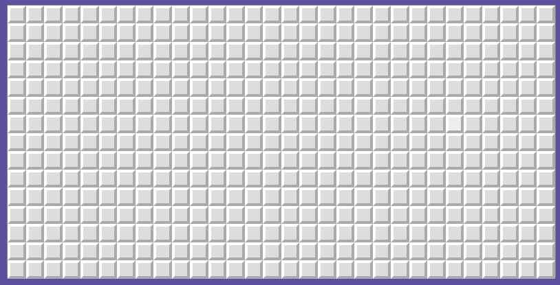
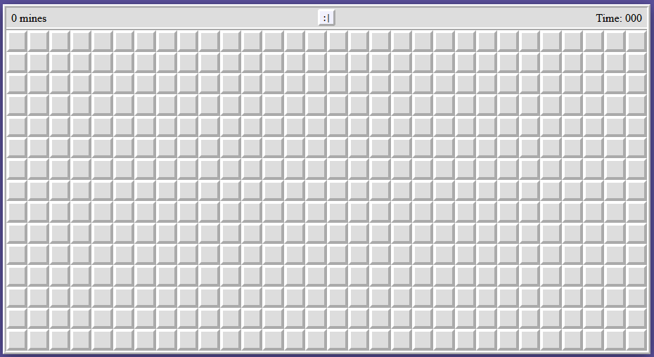

# minesweeper
Welcome back to Minesweeper! Oh, why "back"? Because I'm rewriting the code from scratch, with a better and optimized code and making use of some advanced array methods.

# Play the game:
# https://hectorvilas.github.io/minesweeper/


## roadmap:
As I'm rewriting the same game, the roadmap will be the same as [the previous version](https://github.com/HectorVilas/minesweeper-old-prototype). Some objectives may change during the development.

> I should just rewrite the old one, but that means removing ~90% of the code. I want to keep it as is to see my progress in the future. Also it have some sentimental value, my first recursive function was made there.

- ✅ write down the README file

### things to display on screen:
- ✅ the board
- ✅ counters
- - ✅ remaining mines
- - ✅ time played
- ✅ classic smiley face
- ✅ menu buttons

### game options and buttons:
- ✅ how to play
- ✅ settings
- - ✅ number of mines
- - ✅ board size (X and Y)
- ✅ about
- - ✅ link to my Github profile
- - ✅ credits for any media I may use

### board generation:
- ✅ the board must be generated
- - ✅ width and height defined by option settings
- ✅ mines will be hidden in the board
- - ✅ quantity defined by option settings
- - ✅ the position will be randomized

### game logic:
- ✅ when a tile is clicked
- - ✅ if there's a mine
- - - ✅ show it and reveal the rest of the mines
- - - ✅ the game is over
- - - ✅ the player can't keep clicking on the board without starting again
- - ✅ else, show the number of mines surrounding the tile
- - - ✅ if there's no mines, nothing will be shown
- - - ✅ the surrounding tiles will auto-reveal until there's a mine around
- ✅ right click must add a flag to mark a mine
- - ✅ every flag must reduce the mine counter by one
- - ✅ player can't put more flag than the number of mines
- - ✅ in case of a present flag, it will be removed
- ✅ when all mines has been discovered and tiles without mines revealed
- - ✅ the game ends, announcing it
- - ✅ remaining flags will be placed over the mines
- - ✅ the timer must stop

### visual elements:
#### animations:
- ✅ shockwave effect after revealing a mine
- - ❌ expand the shockwave to the rest of the board
- ❌ animation for board drawing 
#### interface
- ✅ prompt made of divs with absolute position to show in the middle of the screen, over the board itself
- - ✅ if player wins/loses must include "play again" and close buttons
- ✅ "burger" button to show menu on the right of the screen
- - ✅ sliders for board width/height and number of mines
- - ✅ ~~folded "how to play" div with instructions~~ "how to play" option
- - - ✅ include gifs showing how to play
- - ✅ ~~folded~~ "about" div with credits for any third party media used and link to my Github profile

### other ideas:
- ❌ a graphic minefield
- ❌ non-rectangular board shapes
- ✅ sounds
- - ✅ sound toggle button in options
- ❌ show the README.md in the page (may create a new repo for this)
- ✅ replace numbers for images (preventing bad tile scaling)
- ❌ language selector (english - spanish)

### sounds:
- ✅ submarine sonar sound if there's propagation
- ✅ explosion sound if game over

# update 1
Starting again with the game was a really good idea. I just made something in 44 lines of code that took me more than 100 lines in the previous version.

Right now there's nothing on screen, because nothing is done on it for now. If you open the console, you can see a text representation of the board. This will be removed once the game is playable to prevent cheating.

To optimize the game, once the randomizer places a mine, the 8 surrounding non-mined spaces will add 1 to it's number (if it's on range), so no need to calculate every single click while playing.

This is how it looks in the console right now:


# update 2
I added the necessary code to show the board on the page, the tiles are clickables and it will show the surrounding mines or an "m" if there's a mine.

I'm also trying to use some advanced array methods. Tutorials make them look intimidating, but I barely had problems with `.map()` and `filter.()`, at least for basic use. I also tried another workflow for styling. Instead of adding the same attributes to every single thing, I made a generic class to apply those from de HTML. A little example:

```html
<div class="content flex flex-h-center flex-v-center">
```
Right now the game can be played, but without any win or lose condition. Also no propagation of empty tiles, I think this will be the next step.

I'll leave the styling for last, I want to make the game playable first.


# update 3
The tile revealing propagation is finally implemented. I used a recursion to make it, it takes a toll in the CPU usage, may replace in the future.

To make it a little more interesting, the propagation have a timeout so the player can see it in action. Also the "revealed" state have a little transition in the `CSS` to make it more pleasant to look at.

It will be removed when graphics are applied to the tiles, so here's two gifs:




# update 4
The numbers are now images instead of text (had a little fun with InkScape). The code just needed a little adaptation to replace the numbers for It's image version. I may need to move a few thing to a new function to make it easier to put images in the tiles and also the mines and flags (and maybe an interrogation char in case the player suspect of a tile but is not sure).

As the images are PNG's with transparent backgrounds, the revealing effect has been conserved and won't need extra code for it.


Anyways, the game is not playable for now, unless the player want to guess if there's a mine in a revealed empty tile or just no mines around.

The next step would be to draw a mine to show in the board, but so many years has passed since I drawed something in vectors. May take me a while to draw a decent mine. I just don't want to download it, may need some drawing skills in the future. Once I have the drawing, I just need to adapt the code.

# update 5
After spending some time with Blender 3D, Gimp and finally InkScape, I modeled and then traced a mine to use as image. Those files used are in the "Resources" folder.

> I've spent a few years in the past messing on Blender 3D and I know enough of Gimp to get the outline of an image so everything was fine until this point, but InkScape was kind of disappointing. I remember drawing lines and curves on Macromedia Flash 5 like 20 years ago, it was so easy and intuitive, and I was especting the same for this other modern software. My first plan was to trace the mine manually, with straight lines and curves, but ended converting the image into a vectorial one. Maybe I should keep looking for other applications for vectorial images.

The code has also been shortened a bit by moving stuff to a new function, which I also used to draw the mine in case there's one on the tile.

If the image is too small on the board, there it is:


# update 6

Today I wasted time on this little animation, heh. If your selected tile have a mine, a "shockwave" animation will be applied to it and some of it's surrounding tiles. A few seconds later, the remaining mines in the board will be revealed.

The good thing, this have no great effect in the CPU usage. The bad thing, it's not consistent, I don't know why. Still looks good, I think.


# update 7

I've been busy today, so I didn't do much with the game, but at least now the animation is consistent. I didn't know about `"transitionend"` for listeners, I found about it watching again a video I saw one or two months ago. I just nested listeners, so once the tile ends it's transition (growing), then it changes to the next one (shrinking) and so on. There's a little bug with the first mine animation, will try to fix for the next update.


# update 8

solved the first mine no animating. My first solution was partial, the mine would get only two scale changes and stop. Found the real problem: the listeners for `"transitionend"` were listening for any transition, so I limited it to just scale. Now the mine gets animated as the rest of the tiles. If you see the previous gif, you can notice the difference.


# update 9

I just added a win condition, that will "alert" the player once all the non-mined tiles are revealed. This wasn't an easy task. I tried a lot of ways to add in the code a way to reduce the remaining count for every revealed tile, but the way I coded the reveal propagation had a fault: an already revealed tile will receive the "revealed" class again, and this will make the remaining count go down when it shouldn't. A simple `if` solved all the problems, also making sure a revealed tile will not receive a revealed class again.

At this point the game can be played. You reveal a mine, you lose; you reveal all the empty tiles, you win. Now I can start working in the interface! As in the previous project, I want to add sliders for board width/height and number of mines (without letting the player put more mines than tiles).

> the game have some important performance impact. Just moving the cursor over the tiles will make the CPU usage go up to 10%. Maybe it's because I'm using a lot of divs.

# update 10
As the game is now playable, I've been working with the `HTML` and `CSS` for the interface. I'm still too green with the `CSS`, but managed to make a message window that will show on top of whatever is on screen, except for the menu button at the top right.

I also made another placeholder that will appear at the top of the board, like in the classic Minesweeper. It will always have the board width.

All of this is just placeholders, now I should start placing something in those holders.


I like the `darkslateblue` in the background, but I'm not sure about the rest of the colors. I'm pretty sure I'll change the pallete in the future.

# update 11
I just added two sounds: a submarine sonar for the reveal propagation and an underwater sound for the explosion.

I'll give credit to their respective authors in the game itself, but while I don't have it ready, here it is:

- [Sonar](https://freesound.org/people/NoiseCollector/sounds/6164/) sound by [NoiseCollector](https://freesound.org/people/NoiseCollector/) on freesound.org
- [Underwater explosion](https://freesound.org/people/VitaWrap/sounds/434545/) sound by [VitaWrap](https://freesound.org/people/VitaWrap/) on freesound.org

# update 12
Today I've been making some changes on the page style. Also prepared the prompt to show or hide whatever is needed on it. The "options" menu is ready but won't be displayed yet. I still have to code that window.

**note:** done. The code was easy. I made a function that hides everything in the prompt, then shows what it's parameter tells it. Of course, I still have to work in the options itself. Those sliders and checkbox will do nothing for now.


# update 13
This time i've been working on the different prompts. First of all, I added a dropdown menu (not styled yet) that will show "options", "how to play" and "about" buttons. Once one of them is clicked, the dropdown will hide and the prompt will show with the necessary message. I used a single prompt window, the only thing that changes is what is going to be shown on it, because everything is present, but hidden by default.

The "Ok" button and the options still does nothing. May be my next step in this project.

**Note:** added credits for the sound authors in "About/credits" menu.

**Note 2:** now the option settings are functional. The max number of mines can't be higher than `board.width * board.height`.


> I have something to confess: I've been making some personal projects not only for practice, but also to avoid finishing reading about forms (interesting but boring). As you can see in the gif, I ended using what I've learned about forms, heh!

# update 14
I've fixed a problem with `winLoseCondition()`, it was being executed twice. After fixing it, I made another animation: the board will shake once a mine explodes. The first shake looks like it last too much, I'm not sure how to fix that, but for now it's good enough. Maybe I'll change it in the future, may be annoying to see it too often. Another little unwanted detail is how the board will not go back to it's original position, but it's just 1 pixel offset, nothing else. Still may fix in the future.


As an extra, there was a wrong DOM value being modified in the options menu, that's why the "height" slider in the gif above didn't moved the "mines" slider properly until the first modification.

I think it's time to do something with those displays and the face in the center, these are still placeholders. Also the game still have no flags, it's harder to play without those.

There's a lot of work to do to finish this project, I don't want to move to another personal project until this one is done.

# update 15
I noticed something while playing the game: if the mine count is too high, is really easy to fall in a mine while revealing the first tile, making it very hard to start playing. Now the mines are placed after the first click, avoiding the first revealed tile. Because of this, I also limited the max number of mines to `board.width*board.height-1` or the game will fall on an infinite loop with max mines. Also because of this, now the max number of mines will always be a win, I should remember to mock the player for doing this.


(I removed the red background for the mines to prevent flashing lights in the gif)

# update 16
I've been working a little to prepare things to allow placing flags with the right click. Turns out it's not as simple as I thought. I wrote some basic stuff to check if the mouse is being dragged, because now I want the hovered tiles to look pressed while mouse dragging, and reveal the tile when the click is released.

I've also been commenting on the functions, in case I forget what those do in the future.

# update 17
And done, now the buttons will look like pushed if the left click is hold down and the cursor moved over the buttons.


Will happen only with the left button, the flags will be placed in `mousedown`, not `mouseup`, like in the original game (I think). So everything is now ready to start coding the flags! I'm not sure if I should make another "array board" to store it's positions, or just a 1D array with X and Y positions for each flag.

> And here is another confession: I never played Minesweeper when I had it on the OS. I knew the rules, but was never into it. I started liking the game while coding this from scratch, this game is fun!

**note:** now the player can place or remove flags with right mouse click. Once the tile is revealed, the flag will be removed (this was unintentional, another happy little accident). There's no code to limit the number of flags yet, but just having it will make the game more playable than before.


# update 18
Now the mines count on screen will show the remaining mines. Each time the player places a flag, the counter will go down by one. If the counter is at zero, no more flags can be placed until a flag is removed.

When the board reveals the connected empty tiles, if there's a flag, it will be removed and the counter will go up by one for each flag.

About the last part, I wasn't sure if I should reveal empty tiles containing a flag or just ignore during the propagation and let the player guess if the flag is in the right position. I decided to go for the former.

Something to note, this is how I count the flags:
```javascript
let flagsCount = document.querySelectorAll(".flag").length;
display.boardTop.mines.innerText = board.mines - flagsCount;
```

My first approach was adding or removing one in a variable, but then there was a lot of ways something can go wrong, so I decided to cut some corners and just count the tiles containing the class "flag" using `querySelectorAll`. This is way easier and maybe only possible with `HTML`+`JS`, but I'm not sure how CPU intensive is this action. Another thought is, in case I want to write the same in the future, in another language, my first approach was surely the best one.

# update 19
I've been reading the game rules on Wikipedia, and the original Minesweeper not only won't place a mine in the first revealed tile, but does the same for the surrounding tiles, so I made it possible to not have mines around the first revealed tile if `board.width*board.height-9 >= board.mines`.

The face button now have images, and the face will change expresions as in the original game. The code was a little tricky because all the listeners are in the tiles, so dragging the click outside the board will get the face stuck in the surprice state. Solved this problem just adding the normal state to the window's `mouseup` listener.

Also the face button now will restart the game. I had to add a few `if`s to prevent revealing the mines and opening the "game over" prompt after the `setTimeout`s end. Also had to do the same with the propagation. If the player restarts the board during the propagation, it will keep propagating in the new board. `!gameOver` on `if` wasn't a solution, so I used the `firstTile`'s length to know if the game has been restarted, because it will be empty until the first tile is revealed.


Maybe I should get rid of the "you win"/"you lose" prompt, because the face with sunglasses or "X" for eyes will tell the player about it.

# update 20
Today I made a few fixes and changes:
- the mine display in the options was alyaws changing numbers when moving the width or height sliders, instead of doing it only if the max must be reduced.
- the win message was appearing in the next game when the player restarted the game before it showed.
- instead of showing mines when the player wins, the board will show flags.
- the checkbox for sounds in the options menu now works. Unchecking it will mute all sounds.
- the timer is now working. `setInterval` was a little confusing at first, but found the way to make it start and stop when needed.

> I think it's time to move on. I have to finish the game and keep going with the front end course. Right now I can start other fun projects, but I'm limited to simple board games.

# update 21
I've wrote the "how to play" prompt. I also added some images and GIFs to the explanations.

While playing a little to capture those images, I noticed that the method to prevent prompts opening after reseting the board won't always work, so I changed the comprobation to another variable. Now it won't show in the wrong time.

# update 22
I've added a "scan" animation to the board every time the player starts a new game. I wanted to make it advance in diagonal, but I'm still not sure how to do it. Tomorrow I'll try some ways to achieve the result I want. Maybe with a double `for`.

